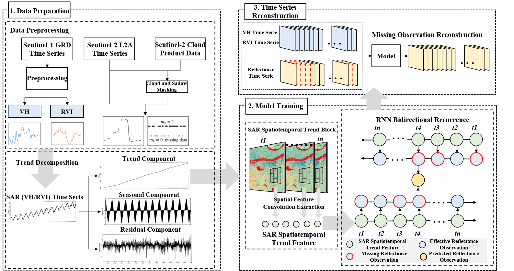

# STORI
Code and Description of STORI model



- We present a novel  Spatio-Temporal Optical Reflectance Interpolation (STORI) method, which integrates Synthetic Aperture Radar (SAR) data and optical reflectance data to reconstruct continuous, high-density reflectance time series. The algorithm does not require any prior knowledge about the spatial distribution.

- STORI effectively fuses SAR and optical data, leveraging the complementary strengths of these modalities. SAR data, with its all-weather capability, fills the gaps in optical data, enabling the generation of cloud-free time series with high temporal resolution.

- The lightweight design of our model allows for efficient and accurate reconstruction without the need for additional training data, making it broadly applicable across various geographical and climatic regions..

**This code is ONLY released for academic use.**

## How to use
We split STORI into two components:

- rank-STORI
  - Framework: Pytorch
  - Training Resnet based Bi-LSTM network on source dataset
  - Learning to rank on target dataset
- STORI
  - Dependencies: Some traditional libraries, including numpy, pickle, matplotlib, seaborn
  - Building spatial temporal model with visual classification results
  - STORI Fusion

Written and tested in python2, Pytorch 1.12.4.

>Attention: make sure you are using the repos specified in STORI. You are possible to meet some errors if you use other version repos.

### Dataset
#### Download
 - [Landsat-TimeSeies]([https://data.csiro.au/collection/csiro:5846](https://data.csiro.au/collection/csiro:5846))
 - [LGC]([https://data.csiro.au/collection/csiro:5847v3](https://data.csiro.au/collection/csiro:5847v3))
 - [CHINA_LANDSAT_MODIS]([https://pan.baidu.com/s/1ymgud6tnY6XB5CTCXPUfnw](https://pan.baidu.com/s/1ymgud6tnY6XB5CTCXPUfnw))
 - [High-Resolution-Image]([http://sshy3s.com/newsitem/27839360](http://sshy3s.com/newsitem/278393600))


#### Configuration
- Pretrain Config: Modify all path containing 'main.py  to your corresponding path.
- Fusion Config 
  - Modify all path containing  to your corresponding path.

### train
Pretrain Resnet52 and Siamese Network using source datasets.

```bash
cd rank-reid/pretrain && python main.py
```

This code will save pretrained model in STORI directory:


## STORI
